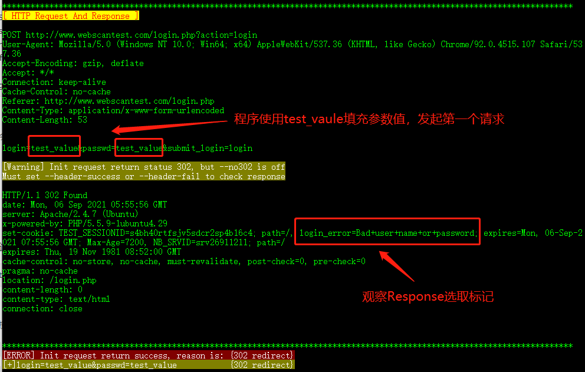
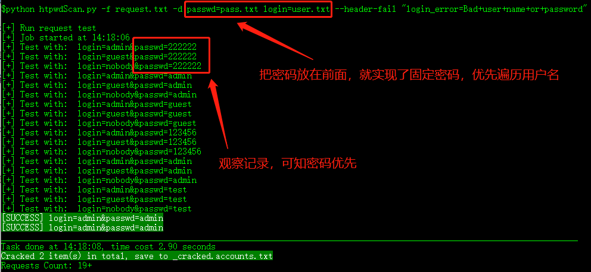
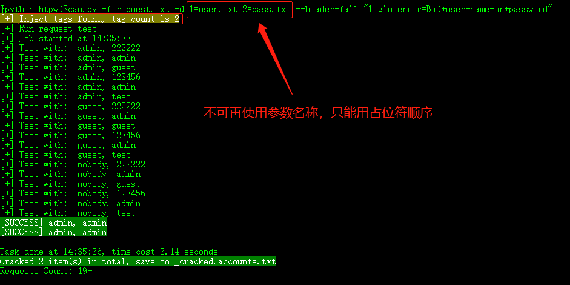

htpwdScan 1.0
====

**htpwdScan** 是一个HTTP暴力破解、撞库测试工具。

### 安装

要求 python3.6 + 

```
pip3 install requirements.txt
```

### 特性

- 支持常见的认证模式：Basic/Digest/NTLM 等
- 支持对 GET / POST 参数进行暴力破解，支持使用占位符选定参数或参数的一部分
- 支持批量校验和导入HTTP代理，通过大量IP低频撞库，绕过IP策略
- 支持导入互联网上泄露的社工库，对接口发起撞库
- 支持编写python函数对参数进行预处理，解决密码策略较苛刻的破解场景，如 Microsoft OWA
- 支持字典文件中的占位符替换
- 支持优先固定密码，遍历用户名，以降低账号被锁定概率
- 支持导入超大字典文件

### 使用示例 ###

* #### **Basic / Digest / NTLM 破解**

  设置用户名、密码字典即可

  ```
  htpwdScan.py -u https://jigsaw.w3.org/HTTP/Basic/ --auth user.txt passwd.txt
  
  htpwdScan.py -u https://jigsaw.w3.org/HTTP/Digest/ --auth user.txt passwd.txt --pass-first
  
  htpwdScan.py -u https://mail.owa-domain.com/ews --auth user.txt pass.txt
  ```


如果检测到目标支持多种认证方式，会提示选择认证方式。 请注意，如果目标是OWA，一般需要选择NTLM


`--pass-first` 参数用于**优先固定密码**，循环遍历用户名，降低账号被锁定的概率。

* #### **参数二次处理**

程序支持参数二次处理：计算hash、大小写转换、拼接、引用其他参数值等。

**用法：一般地，使用函数名包围字典文件名。 在撞库模式下，使用函数名包围参数名**

```
htpwdScan.py -u https://jigsaw.w3.org/HTTP/Basic/ --auth user.txt md5(passwd.txt)
```

执行上面的例子，可以观察到密码已经是md5 hash。  

在更复杂的场景中，可以使用函数为2拼、3拼用户名组合生成复杂密码，

如用户名为 Li JieJie，生成 `LJJ@123` `LiJJ@2021` `Jiejie@2021` `jiejie@123456`。参考：[如何自定义函数](docs/functions.md)

* #### **GET参数破解**

GET参数的破解非常简单，例如：破解 http://demo.com/get_brute?key=123 中的 `key` 参数

```
htpwdScan.py -u http://demo.com/get_brute?key=123 -d key=passwd.txt --get --fail FAIL
```

1. 通过 `-d` 来导入字典： **参数名=字典路径**
2. 通过 `--get` 显式指定使用GET方法，默认为POST
3. 通过 `--fail`  标记一个失败的请求，正文中的标记字符串。当这个字符串没有出现时，则表明破解成功了

如果字典填充的是参数中的一部分，可使用**占位选定（使用3个$符号前后包围即可）**。

```
htpwdScan.py -u http://demo.com/get_brute?key=123$$$val$$$456 -d 1=password.txt --get --fail FAIL --silent
```

在上述例子中，参数值的前缀123和后缀456，都将被保留。请注意，此时设定参数，已经不能再使用名称key，只能**使用占位数字序号**，1,2,3递增。


* #### **设定破解标记**

需要设定1个或多个参数，让程序理解一个请求是破解失败或成功。 如果没有设定，则以302跳转来认定破解成功。

> --fail 失败的请求，正文中的标记字符串。 可以跟多个值
>
> --suc 破解成功的请求，正文中的标记字符串。可以跟多个值
>
> --header-fail  失败的请求，Header中的标记字符串
>
> --header-suc  破解成功的请求，正文中的标记字符串

* #### **破解登录接口**

本节示例破解 http://www.webscantest.com/login.php  。 将登录请求复制到文件`request.txt`中（精简如下）

```
POST /login.php?action=login HTTP/1.1
Host: www.webscantest.com
Content-Type: application/x-www-form-urlencoded
Referer: http://www.webscantest.com/login.php

login=admin&passwd=123456&submit_login=login
```

执行 `python htpwdScan.py -f request.txt -d login=user.txt passwd=pass.txt`

用user.txt 填充login 用户名参数，用pass.txt 填充 passwd 密码参数。

程序会首先发送一个请求，测试Response是否正常。


因为这个接口无论登录成功失败，都会返回302。所以程序无法判断是否破解成功。 通过`--debug` 参数查看HTTP Response

```
python htpwdScan.py -f request.txt -d login=user.txt passdw=pass.txt --debug
```



通过设定 `--header-fail "login_error=Bad+user+name+or+password"` 即可发起破解，完整命令如下

```
python htpwdScan.py -f request.txt -d login=user.txt passwd=pass.txt --header-fail "login_error=Bad+user+name+or+password"
```

在request.txt文件中，也可以使用函数对参数值进行二次处理。参考 [tests/test_request_file_hash.py](tests/test_request_file_hash.py)

* #### **更换参数顺序，实现密码优先**

设定参数的顺序，只影响程序生成字典的顺序。简单调整参数的顺序，即可实现固定密码，优先遍历用户名，减少账号被锁定的几率。修改上一节的命令：

```
python htpwdScan.py -f request.txt -d passwd=pass.txt login=user.txt --header-fail "login_error=Bad+user+name+or+password"
```



* #### 在HTTP请求中，使用占位符选取参数
	

修改上面小节中的 `request.txt` 文件，使用占位符来选取`login参数`和`passwd参数`。也可以选取任意的部分
	POST /login.php?action=login HTTP/1.1
	Host: www.webscantest.com
	Content-Type: application/x-www-form-urlencoded
	Referer: http://www.webscantest.com/login.php
	
	login=$$$admin$$$&passwd=$$$123456$$$&submit_login=login

执行

 `python htpwdScan.py -f request.txt -d 1=user.txt 2=pass.txt --header-fail "login_error=Bad+user+name+or+password"`

可观察到破解任务按照预期执行



如果需要使用函数对参数值进行二次处理。参考 [tests/test_place_holder_file_hash.py](tests/test_place_holder_file_hash.py)

* #### 撞库测试
	

使用互联网上泄露的社工库，对接口进行撞库测试。
在tests文件夹中，模拟写入了一个 `leaked_db.txt` 文件，它使用多个空格分隔了用户名和密码。

```
python htpwdScan.py -f tests/login_request.txt --database login,passwd=tests/leaked_db.txt --regex (\S+)\s+(\S+) --header-fail login_error=Bad+user+name+or+password
```

撞库时，通过--database参数，来指定参数和字典文件。`login` `passwd`参数将由 leaked_db.txt中的内容填充。

填充时通过正则表达式提取参数值。`--regex (\S+)\s+(\S+)`  指定提取参数值的方式，在这个例子中，提取第一个非空字符串和第二个非空字符串。

csdn的数据行格式是`zdg # 12344321 # zdg@csdn.net` . 正则表达式可写作`\S+ # (\S+) # (\S+)`

为了降低IP被检出异常的概率，建议同时指定 `--fake-ip` 参数，开启伪造HTTP头 `X-Forwarded-For`  `Client-IP`

在撞库场景下，如果要对字典中的参数值进行二次处理，用函数包围参数名。参考： [tests/test_import_from_leaked_db_hash.py](tests/test_import_from_leaked_db_hash.py)

* #### 校验和导入HTTP代理

在使用代理之前，应该校验代理服务器可以连通目标。如果服务器数量少，直接在命令行中指定，逗号分隔：

```
python htpwdScan.py --proxy 127.0.0.1:8888,127.0.0.1:8080 --check-proxy -u https://www.baidu.com --suc 百度一下 --get -o servers.txt
```

如果代理数量数量多，将其写入一个文件中用于校验：

```
python htpwdScan.py --proxy-file tests/proxies.txt --check-proxy -u https://www.baidu.com --suc 百度一下 --get -o servers.txt
```

请注意：**如果代理服务器是HTTP协议的，可以忽略协议部分。 如果是HTTPS的，则必须指定协议**

在发起破解时，同样地，使用 `--proxy` 或者 `--proxy-file`  来指定经过校验的服务器即可。

如果你想要使用Fiddler 或者 Burp Suite观察程序的请求，可以指定 `--proxy 127.0.0.1:8080`

## 参数说明 ##
	usage: htpwdScan.py [options]
	
	* HTTP weak pass scanner. By LiJieJie *
	
	Target:
	  -u RequestURL         指定破解的URL
	                        -u "https://www.test.com/login.php"
	  -f RequestFile        从文本文件中，导入HTTP请求
	  --https               当从文件导入HTTP请求时，强制使用HTTPS
	  --get                 强制使用HTTP GET，默认POST
	  --auth  [ ...]        Basic/Digest/NTLM 暴力破解,
	                        e.g. --auth users.txt pass.txt
	                        e.g. --auth users.txt my_own_func(pass.txt)
	  --pass-first          固定密码优先爆破,减小账号被锁定几率
	
	Dictionary:
	  -d Param=DictFile [Param=DictFile ...]
	                        为参数设置字典文件, 支持二次处理参数值
	                        e.g. -d user=users.dic pass=md5(pass.dic)
	                        高级用户可自写python函数处理参数，lib/value_process.py
	                        e.g. -d user=users.dic pass=capitalize(pass.dic)
	
	Detect:
	  --no302               302跳转不敏感, 默认敏感，视为破解成功标记
	  --fail Fail [Fail ...]
	                        破解失败时的正文标记,可以是多个
	                        e.g. --fail "user not exist" "password wrong"
	  --suc Suc [Suc ...]   破解成功时的正文标记,可以是多个
	                        e.g. --suc "welcome," "logout"
	  --header-fail HeaderFail
	                        位于HTTP头中的破解失败标记
	  --header-success HeaderSuccess
	                        位于HTTP头中的破解成功标记
	  --retry-txt RetryText
	                        当该文本出现时，视为当前请求无效，会再次重试
	                        e.g. --retry-txt="IP blocked"
	  --retry-no-txt RetryNoText
	                        当该文本没有出现时，视为当前请求无效，会再次重试
	                        e.g. --retry-no-txt="<body>"
	  --retry-header RetryHeader
	                        当该文本出现在HTTP头时，视为当前请求无效，会再次重试
	                        e.g. --retry-header="Set-Cookie:"
	  --retry-no-header RetryNoHeader
	                        当该文本没有出现在HTTP头时，视为当前请求无效，会再次重试
	                        e.g. --retry-no-header="HTTP/1.1 200 OK"
	
	Proxy and Spoof:
	  --proxy Proxy         命令行设定若干代理服务器
	                        e.g. --proxy=1.2.3.4:8000, 5.6.7.8:8000
	  --proxy-file ProxyFile
	                        通过文件导入若干代理服务器
	                        e.g. --proxy-file=proxies.txt
	  --check-proxy         校验HTTP代理服务器是否工作正常
	  --fake-ip             伪造HTTP头 X-Forwarded-For，尝试伪造源IP
	  --fake-sid FakeSID    伪造session ID
	  --sleep Seconds       请求完成后延时N秒，减小被服务器封禁IP的几率
	
	Database attack:
	  --database param1,parma2=file
	                        导入社工库进行撞库测试
	                        e.g. --database user,pass=csdn.txt
	  --regex REGEX         按行正则提取参数值. e.g. --regex="(\S+)\s+(\S+)"
	
	General:
	  -t Threads            并发工作线程，默认50
	  --allow-redirect      允许Follow 30x调整，默认禁止
	  -o OutFile            输出文件名。 默认为： _proxy.servers.txt 或 _cracked.accounts.txt
	  --debug               进入调试模式，观察程序行为
	  --silent              减少程序输出，只输出破解成功的条目
